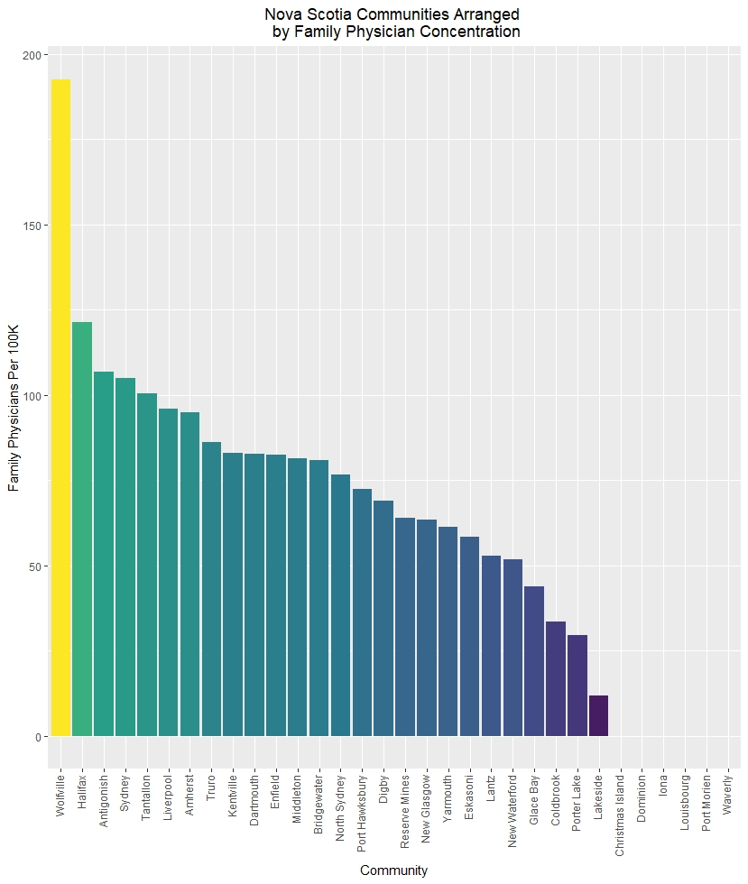

## Introduction
Health care is an important part of living in Nova Scotia. Traditionally people accessed the healthcare system through their Family Physician.  As of April 1, 2020, [46,051](http://www.nshealth.ca/sites/nshealth.ca/files/finding_a_primary_care_provider_in_nova_scotia_report_april_2020.pdf) Nova Scotians have indicated that they are unable to find a Family Physician.
This report will look at:

-The distribution of Family Physicians in Nova Scotia.  
-Possibility of a Family Physicians shortage due to retirements.

## Data

### The Forward Sortation Area
This report relies heavily on data that has been segmented by geographic region.  The fundamental region utilized is the Forward Sortation Area (FSA).  The FSA is the first half of a Canadian Postal code. *ie. **B3K** 2T3*. Statistics Canada publishes some data by linking it with an FSA.  Statistics Canada also publishes a GIS file containing the [FSA boundaries](https://www150.statcan.gc.ca/n1/en/catalogue/92-179-X) of Canada.

### Population
The distribution of Nova Scotia’s population was obtained from Statistics Canada’s [Population and Dwelling Count Highlight Tables, 2016 Census]( https://www12.statcan.gc.ca/census-recensement/2016/dp-pd/hlt-fst/pd-pl/Table.cfm?Lang=Eng&T=1201&S=22&O=A)

### Family Physician Data
The data pertaining to Physicians was obtained through the [College Of Physicians & Surgeons Of Nova Scotia](https://cpsns.ns.ca/) (CPSNS).  Using the Physician search page, users can download a .CSV file of summary information on every Physician practicing in Nova Scotia.  While the file contains useful information, it does not contain all the information available on the site. A simple web scraper was scriped using RStudio and the package rvest to obtain the following from CPSNS:

-Each Physicians graduation year.  
-Each Physician's business address.  

## ETL, Calculation and Graphics
All ETL, calculations and graphics were performed using a script written in RStudio.

## Distribution of Family Physicians in Nova Scotia
Combining the number of Family Physicians with the population in each FSA enables the calculation of Family Physicians per 100,000 people in each area.  This metric is used to colour each FSA according to the Family Physicians per 100k.  The map is shown below.

In the above map there are are grey coloured areas, these are areas where a Family Physician is not practicing.  These areas are close to the HRM, Truro and in Eastern Cape Breton.  The areas around the HRM and Truro can be explained due to their proximity to a large population center with greater Family Physician coverage.  The lack of a Family Physician in Eastern Cape Breton is less likely due to its proximity to Sydney and may be an area that is genuinely in need of Family Physicians.  
The area covered by each FSA can vary significantly.  The difference in FSAs leads to some areas being obscured.  By associating each FSA with a community, it is possible to group the FSAs and make direct comparisons.

Surprisingly, the communities making up the HRM, are not the communities with the highest number of Family Physicians per 100,000 people. The top four communities do have a common factor, they are all communities that contain at least one University.

## Estimating Family Physician Retirements
By using the year a Physician graduated from Medical School, it is possible to estimate their age.  The data retrieved from the College Of Physicians & Surgeons Of Nova Scotia contains the date and reason a Physician has inactivated their licence.  Using this information, I have calculated the average retirement age for a Family Physician to be 64.3 years. 
Applying the calculated retirement age to the active Family Physicians in Nova Scotia, it is possible to estimate how many of these Physicians are within five years of retirement. Grouping Family Physicians by community, it is possible to predict which communities may be most impacted by Physician retirements in the next five years.

From the above chart the top three communities that could be impacted by Family Physician retirements are Enfield, Liverpool and New Glasgow.

